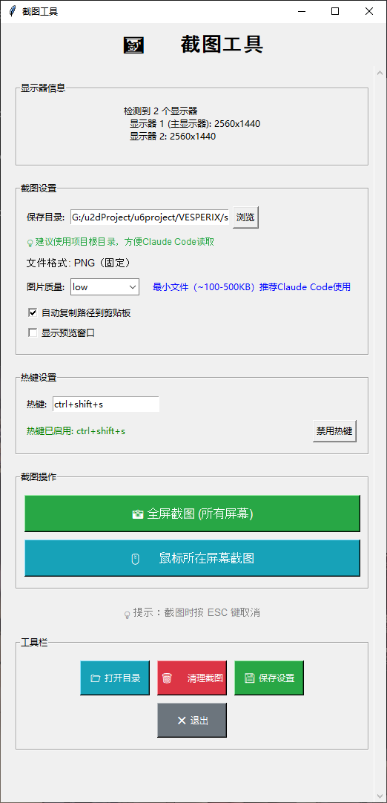

# 📸Windows Claude Code 专用截图工具

> **GUI作用**：提供可视化截图配置界面，支持热键截图、多屏幕捕获、文件管理等功能，专为Claude Code优化的截图解决方案。

---

## ⚡ **快速使用指南**（重要提示）

### 🔥 **4步快速上手**

```
1️⃣ 管理员权限打开 ScreenshotTool.exe (dist/ScreenshotTool.exe)
（如果需要开机自启动，windows可以自定义开机启动这个exe）
2️⃣ 点击"启用热键"按钮
3️⃣ 按下热键 Ctrl+Shift+S（热键可自定义） 进行截图
4️⃣ 在Claude Code中 Ctrl+V 粘贴图片
```

### 💡 **关键提示**
- ⚠️ **必须管理员权限运行**，否则热键功能无法正常工作
- 📋 **自动复制路径到剪贴板**，无需手动操作
- 🎯 **默认Low质量模式**，最适合Claude Code使用

---

## 🎯 工具特色

- 🚀 **专为 Claude Code 优化**：默认low质量模式，文件小（100-500KB），适合Claude Code使用
- ⌨️ **全局热键支持**：支持自定义热键（默认 Ctrl+Shift+S），随时快速截图
- 🖱️ **多屏幕支持**：完美支持多显示器环境，可跨屏截图
- 📋 **自动复制路径**：截图后自动复制文件路径到剪贴板，Claude Code中直接粘贴
- 🎨 **友好GUI界面**：直观的图形界面，所有功能一目了然
- 🗑️ **智能清理功能**：一键清理历史截图，管理存储空间

### 🖥️ GUI界面功能详解




#### 📊 **显示器信息**
- 自动检测所有连接的显示器!
- 显示每个显示器的分辨率信息
- 支持多屏幕截图

#### ⚙️ **截图设置**
- **保存目录**：可自定义截图保存位置
  - 💡 建议使用项目根目录，方便Claude Code读取
- **文件格式**：固定PNG格式（最佳兼容性）
- **图片质量**：三档可选
  - **Low**：100-500KB，推荐Claude Code使用 ⭐
  - **Medium**：500KB-2MB，平衡质量
  - **High**：2MB+，高质量（⚠️消耗大量token）
- **自动复制路径**：截图后自动复制文件路径到剪贴板
- **显示预览窗口**：截图完成后显示预览

#### ⌨️ **热键设置**
- **自定义热键**：默认 `Ctrl+Shift+S`
- **启用/禁用**：一键开关热键功能
- **状态显示**：实时显示热键状态

#### 📸 **截图操作**
- **全屏截图**：捕获所有屏幕内容
- **鼠标屏幕截图**：只截取鼠标当前所在的屏幕
- **ESC取消**：截图过程中按ESC键取消

#### 🔧 **工具栏**
- **📁 打开目录**：快速打开截图保存目录
- **🗑️ 清理截图**：智能识别和清理历史截图文件
- **💾 保存设置**：保存当前配置
- **❌ 退出**：安全关闭程序

---
##  以下是DIY区域 ，如果只想使用现有功能请返回 ⬆️ ⬆️ ⬆️ ⬆️ ⬆️ ⬆️ ⬆️ ⬆️ ⬆️

## 🛠️ 自定义与扩展

### 🤖 使用 Claude Code 进行自定义

想要自定义截图工具的功能？Claude Code 是您的最佳助手！

#### 💡 **自定义建议**

1. **分享代码**：将 `screenshot_gui.py` 或 `screenshot_tool_new.py` `build_spec.py` 的内容贴给 Claude Code
2. **描述需求**：详细说明您想要的功能改进
3. **获得方案**：Claude Code 会分析代码并提供修改建议
4. **应用修改**：按照建议修改代码并测试

#### 🔧 **常见自定义场景**

- 🎨 **界面美化**：修改颜色、布局、字体
- ⌨️ **快捷键扩展**：添加更多热键组合
- 📁 **文件管理**：自定义文件命名规则
- 🔄 **工作流优化**：集成其他工具
- 📊 **统计功能**：添加截图统计和分析
- 🎯 **特殊截图模式**：窗口截图、区域预设等

## 🔨 构建可执行文件

### 📁 环境准备

1. **进入项目目录**
   ```bash
   cd /path/to/VESPERIX/scripts/windows-screenshot-tool-forcc
   ```

2. **激活虚拟环境**
   ```bash
   # Windows:
   venv\Scripts\activate
   
   # 看到 (venv) 提示符表示激活成功
   ```

3. **修复依赖（如遇到模块缺失错误）**
   
   如果出现类似以下错误：
   - `ModuleNotFoundError: No module named 'pyperclip'`
   - `ModuleNotFoundError: No module named 'PyInstaller'`
   
   请先修复依赖：
   ```bash
   # 确保在虚拟环境中（看到 (venv) 提示符）
   python fix_dependencies.py
   
   # 或使用批处理脚本
   install_dependencies.bat
   ```

### 🚀 使用 build_spec.py 构建

```bash
# 确保在虚拟环境中（看到 (venv) 提示符）
cd /path/to/VESPERIX/scripts/windows-screenshot-tool-forcc

# 运行构建脚本
python build_spec.py
```

### 📋 构建菜单选项

运行 `build_spec.py` 后会出现交互菜单：

```
请选择操作:
1. 安装依赖
2. 构建可执行文件  
3. 创建spec文件
4. 清理构建文件
5. 全部执行 (安装依赖 + 构建)  ⭐ 推荐新用户
0. 退出
```

**推荐选择选项5**，自动完成所有步骤。

### 📁 构建结果

构建成功后，在 `dist/` 目录下会生成：
- `ScreenshotTool.exe` - 独立可执行文件

---

---

## 📞 支持与反馈

如果您遇到问题或有改进建议：

欢迎提issue
---
